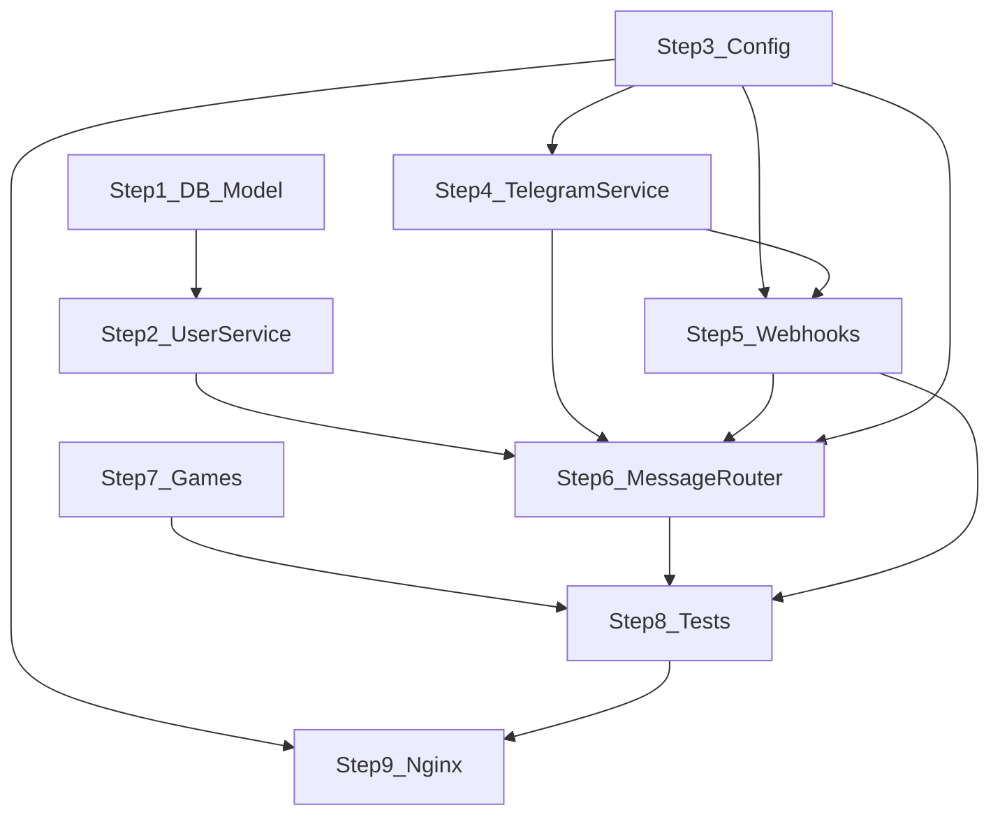

# Phase 5: Backend Merge Plan

**MyKasiBets — Game engine, database, webhooks, orchestration**  
**Version:** 1.0  

**Prerequisites:** Read [PHASE_5_OPTIONS_AND_DECISIONS.md](./PHASE_5_OPTIONS_AND_DECISIONS.md).

This plan orders work **game engine and persistence first**, then ingress (webhooks, nginx), then orchestration merge and tests. Adjust estimates per team velocity.

---

## 1. Objectives

1. One **PostgreSQL schema** supporting WhatsApp and Telegram users with **separate users per channel** (no cross-channel wallet merge in Phase 5).
2. One **FastAPI** app exposing **two webhook entry points** (separate URL paths).
3. One **game engine** tree under `app/services/games/` with **no silent divergence** between former repos.
4. One **message orchestration** path that does not duplicate game rules for the two channels.

---

## 2. Affected files and modules (canonical repo: `my-kasi-bet`)

| Area | Primary paths |
|------|----------------|
| App entry | `app/main.py` |
| Webhooks | `app/api/webhook.py` → split/replace with e.g. `app/api/whatsapp_webhook.py`, `app/api/telegram_webhook.py` (names TBD by team) |
| Config | `app/config.py`, `.env.example` |
| DB | `app/database.py`, `app/models/user.py`, `alembic/versions/` |
| User domain | `app/services/user_service.py` |
| Outbound WhatsApp | `app/services/whatsapp.py` |
| Outbound Telegram | **New:** port from `my-kasi-bet-telegram/app/services/telegram_service.py` |
| Orchestration | `app/services/message_router.py` (~3398 lines) |
| Games | `app/services/games/` (`color_game.py`, `football_yesno.py`, `lucky_wheel.py`, `pick_3.py`, `__init__.py`) |
| Tests | `tests/test_webhook.py`, extend for both channels |
| Reverse proxy | `nginx/nginx.conf` |
| Orchestration | `docker-compose.yml` if env vars added |

**Reference repo (read-only merge source):** `my-kasi-bet-telegram/` — same layout; use for three-way diffs.

---

## 3. Ordered implementation steps

### Step 1 — Database migration and model

**Goal:** Align `User` with Telegram-capable schema while preserving existing WhatsApp rows.

1. Add Alembic revision **after** existing `001_initial_migration.py` (revision id chosen by team; content analogous to telegram repo’s `002_add_telegram_chat_id.py`):
   - Add column `telegram_chat_id` (string, nullable, unique index).
   - Alter `phone_number` to **nullable** (Telegram-only users).
2. Update `app/models/user.py`:
   - Add `telegram_chat_id` field and docstring updates.
   - Ensure uniqueness and indexes match migration.
3. Optional but recommended: add a **CHECK** constraint ensuring `(phone_number IS NOT NULL) OR (telegram_chat_id IS NOT NULL)` if the database supports it cleanly; otherwise enforce in `UserService` with tests.

**Verification:** `alembic upgrade head` on empty DB; `upgrade` on copy of production-like data with only WhatsApp users (all have `phone_number` set).

**Owner:** Backend + DBA review.

---

### Step 2 — User service

**Goal:** Single `UserService` supporting both channels.

1. Merge methods from `my-kasi-bet-telegram/app/services/user_service.py`:
   - `get_user_by_telegram_chat_id`
   - `get_or_create_user_by_telegram`
2. Retain existing methods:
   - `get_or_create_user` (phone)
   - `get_user_by_phone`
   - `update_last_active`
3. Ensure new Telegram users set `phone_number=None`, `telegram_chat_id` set; WhatsApp users set `phone_number`, `telegram_chat_id=None` unless linking exists later.

**Tests:** Unit tests for create/get paths per channel (minimal DB fixtures).

---

### Step 3 — Configuration

**Goal:** All secrets and URLs in one settings module.

1. Extend `app/config.py` with:
   - `TELEGRAM_BOT_TOKEN` (optional in dev; required when Telegram is enabled).
2. Keep existing WhatsApp settings: `WHATSAPP_API_URL`, `WHATSAPP_PHONE_NUMBER_ID`, `WHATSAPP_ACCESS_TOKEN`, `WHATSAPP_VERIFY_TOKEN`.
3. Update `.env.example` with commented placeholders and short descriptions.

---

### Step 4 — Telegram outbound service

**Goal:** Port `TelegramService` from telegram repo into `app/services/telegram_service.py` (or equivalent).

1. Copy behavior: `httpx` calls to `https://api.telegram.org/bot{token}/...`.
2. Preserve error handling used by telegram `message_router` (e.g. `TelegramChatNotFoundError` if present).
3. Expose singleton `telegram_service` mirroring `whatsapp_service` pattern.

**Dependency check:** `requirements.txt` must include `httpx` if not already present.

---

### Step 5 — Webhook layer (two entry points)

**Goal:** Replace single `/webhook` router with path-separated routes per [OPTIONS_AND_DECISIONS](./PHASE_5_OPTIONS_AND_DECISIONS.md).

**WhatsApp (from current `app/api/webhook.py`):**

- **GET:** `hub.mode`, `hub.verify_token`, `hub.challenge` → echo challenge for Meta verification.
- **POST:** Parse WhatsApp JSON; for `object == "whatsapp_business_account"`, extract text messages; call orchestration with **phone-based** identity (normalized phone, `message_id`).

**Telegram (from `my-kasi-bet-telegram/app/api/webhook.py`):**

- **GET:** `200` + `{ "status": "ok" }` (health / URL existence).
- **POST:** Parse Telegram `Update`; require `message` and `text`; call orchestration with `chat_id`, `message_id`, `username`.

**Mount:** In `app/main.py`, include both routers with prefixes such as `/webhook/whatsapp` and `/webhook/telegram` (exact paths must match nginx and provider configuration).

**Breaking change:** Existing deployments using `/webhook` for Meta must **update** Meta dashboard to the new WhatsApp path. Document in [PHASE_5_EDGE_CASES_AND_RUNBOOKS.md](./PHASE_5_EDGE_CASES_AND_RUNBOOKS.md).

---

### Step 6 — Message orchestration merge

**Goal:** One game flow; two channel adapters.

**Current state:** Both repos have `app/services/message_router.py` (~3398 lines). WhatsApp branch uses `whatsapp_service` + phone normalization; Telegram uses `telegram_service` + `get_or_create_user_by_telegram`.

**Recommended approach:**

1. **Diff** `message_router.py` between repos (use `diff` or merge tool); identify identical blocks vs channel-specific blocks.
2. Introduce **channel context** or **outbound port** interface:
   - Inputs: user entity, raw message id, reply metadata.
   - Methods: `send_message`, `mark_as_read` (WhatsApp only if applicable).
3. Implement **two thin entry methods** or one `route_message(channel, ...)` that delegates to shared `_handle_state_flow` / `_handle_main_menu` after user resolution.
4. **User resolution:**
   - WhatsApp path: normalize phone → `get_or_create_user(phone)`.
   - Telegram path: `get_or_create_user_by_telegram(chat_id, username)`.

**Risk:** Large merge conflicts. Mitigation: assign one owner; use feature branch; merge main frequently.

---

### Step 7 — Game engine reconciliation

**Goal:** No duplicate or divergent rules.

1. Run file-by-file diff for `app/services/games/` between repos:
   - Confirmed difference: `football_yesno.py` differs; review all four game modules.
2. For each difference, choose **authoritative** behavior (product owner if business rules differ).
3. Add or adjust tests when behavior is non-trivial.

**Deliverable:** Short “games merge log” in PR description listing files touched and decisions.

---

### Step 8 — Tests

| Test | Description |
|------|-------------|
| WhatsApp GET verification | Existing `test_webhook_verification_*`; update paths to `/webhook/whatsapp` (or chosen path). |
| WhatsApp POST text | Existing payload tests; update URL. |
| Telegram GET | GET returns ok on Telegram path. |
| Telegram POST | Mock `message_router` or full integration with test DB; assert `route_message` args (`chat_id`, text, `message_id`, `username`). |
| User creation | Telegram user has `telegram_chat_id`, null phone; WhatsApp user has phone, null `telegram_chat_id`. |

**Location:** `tests/test_webhook.py` (split into files if needed: `test_whatsapp_webhook.py`, `test_telegram_webhook.py`).

---

### Step 9 — Nginx and Docker

1. **nginx:** Add `location` blocks for both webhook paths (same proxy headers, timeouts as current `/webhook` block in `nginx/nginx.conf`).
2. **docker-compose:** Pass `TELEGRAM_BOT_TOKEN` into backend service if needed.
3. **Smoke:** `curl` GET/POST against both paths through nginx in staging.

---

## 4. Test matrix (minimum)

| # | Scenario | Expected |
|---|----------|----------|
| 1 | WA GET verify with correct token | 200, challenge body |
| 2 | WA GET verify wrong token | 403 |
| 3 | WA POST text message | 200, router invoked with normalized phone |
| 4 | TG POST with text | 200, router invoked with chat_id string |
| 5 | TG POST no `message` | 200, no crash |
| 6 | Migration on DB with existing WA users | All retain phone; `telegram_chat_id` null |

---

## 5. Dependencies between steps

**Note:** Step 7 can proceed in parallel with Step 6 once diffs are known; Step 8 gates release.

---

## 6. Risks (execution)

| Risk | Mitigation |
|------|------------|
| `message_router` merge conflicts | Dedicated merge branch; owner; possibly merge Telegram side in small commits |
| Production migration downtime | Backup, `alembic upgrade` in maintenance window, rollback script in EDGE_CASES doc |
| Wrong webhook URL in Meta/Telegram | Checklist before go-live; staging validation |

---

**Next document:** [PHASE_5_ADMIN_DASHBOARD_MERGE_PLAN.md](./PHASE_5_ADMIN_DASHBOARD_MERGE_PLAN.md)
